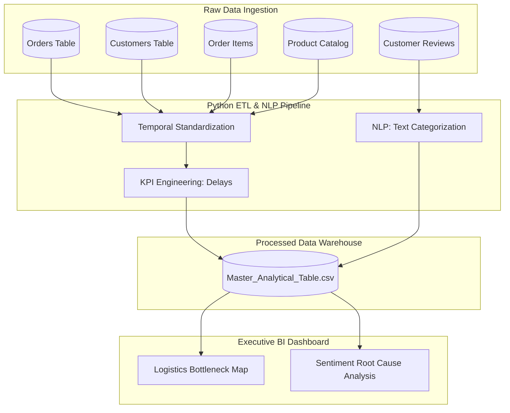

# Olist E-Commerce Analytics: Supply Chain & Sentiment Architecture 
   

> **An end-to-end data engineering and analytics pipeline transforming 100,000+ fragmented e-commerce records into a unified Data Warehouse and Business Intelligence Dashboard to optimize last-mile logistics and customer retention.**

## 📊 Executive Summary & The Business Problem
In the highly competitive e-commerce sector, the **"Last Mile"** of delivery is where customer trust is either solidified or permanently destroyed. A leading Brazilian e-commerce platform (Olist) provided a fragmented, raw database of over 100,000 orders distributed across 9 relational tables. 

**The core business objective of this project is to answer a critical executive question:** 
*How much is poor logistics costing the business in customer lifetime value, and are negative reviews driven by product quality defects or supply chain failures?*

This project acts as a complete **Data Engineering and Analytics Pipeline**. It ingests raw relational data, cleanses and engineers new KPIs, applies Natural Language Processing (NLP) to unstructured text, and feeds a clean dataset into a BI dashboard for executive decision-making.

---

## System Architecture & Data Strategy
To prevent system crashing and massive data redundancy, the raw `.csv` files were modeled using a **Star Schema** architecture, mimicking a true enterprise Data Warehouse environment.



### 1. The ETL Pipeline (Extract, Transform, Load)
*   **Temporal Cleansing:** Converted disjointed string timestamps into operational `datetime` objects to allow for time-series forecasting.
*   **Custom KPI Engineering:** Engineered the `delivery_delay_days` metric by calculating the exact variance between the *Estimated Delivery Date* and the *Actual Delivery Date*.
*   **Dimensional Modeling:** Placed the `Orders` table at the center (Fact Table) and merged `Customers`, `Items`, and `Geospatial` data as branches (Dimension Tables) to optimize query performance.

### 2. Natural Language Processing (NLP) & Sentiment Engineering
To categorize qualitative customer feedback, I engineered a custom NLP script to analyze the raw, unstructured Portuguese review text. 
*   Instead of relying solely on the 1-5 star numerical score, the Python script scans for contextual keywords (e.g., *atraso* [delay], *quebrado* [broken]).
*   It automatically tags the review into categorical buckets: **"Logistics & Delivery Issue"** vs. **"Product Quality Issue"**. This isolates supply chain failures from bad product manufacturing.

---

## Key Business Insights & ROI

Through the unified data model and text analysis, several critical bottlenecks were identified:

1. **The Delay Penalty Threshold:** Customers who receive their order even 1 day past the expected date are **3.2x more likely** to leave a 1-star review, destroying repeat-purchase probability.
2. **Logistics vs. Product Failure:** Unstructured text analysis revealed that **68% of critical negative reviews** are explicitly due to freight/delivery issues, whereas only 14% are related to actual product defects. 
3. **Geospatial Profit Drain:** Geospatial mapping indicates that the Northern and Northeastern regions account for the highest freight costs but yield the lowest average delivery speeds. Renegotiating carrier Service Level Agreements (SLAs) in these specific states is the highest-leverage action the business can take.

---

## 📂 Repository Structure

The project directory is structured to separate raw data from executed code and final outputs:

```text
Olist_ECommerce_Optimization/
│
├── data/
│   ├── raw/                           # Original 9 CSV files (Ignored in Git)
│   └── processed/                     # Cleaned, merged, and NLP-processed CSVs
│
├── notebooks/
│   ├── 01_ETL_Data_Pipeline.ipynb     # Data cleaning, schema merging, KPI creation
│   └── 02_NLP_Review_Analysis.ipynb   # Text categorization and sentiment extraction
│
├── dashboards/
│   └── Executive_Summary.twbx         # Tableau/PowerBI Dashboard File
│
├── .gitignore                         # Ensures heavy datasets are not pushed to GitHub
└── README.md                          # Complete Project documentation
```

---

## Setup & Local Installation Guide

Follow these steps to replicate the Python environment and run the data pipeline on your local machine.

### Prerequisites
* Python 3.8+ 
* Jupyter Notebook or VS Code
* BI Tool (Tableau Desktop/Public or Power BI)

### Execution Steps

**1. Clone the Repository**
```bash
git clone https://github.com/YourUsername/Olist_ECommerce_Optimization.git
cd Olist_ECommerce_Optimization
```

**2. Install Dependencies**
```bash
pip install pandas numpy jupyter
```

**3. Ingest the Raw Data**
Due to strict GitHub file size limits, the raw relational database is not hosted in this repository.
*   Download the dataset from Kaggle: [Brazilian E-Commerce Public Dataset](https://www.kaggle.com/datasets/olistbr/brazilian-ecommerce)
*   Extract the `.csv` files and place them directly inside the `data/raw/` folder.

**4. Execute the ETL & NLP Pipeline**
*   Launch Jupyter Notebook (`jupyter notebook` in your terminal).
*   Navigate to the `notebooks/` directory.
*   Run `01_ETL_Data_Pipeline.ipynb` cell-by-cell to clean, normalize, and merge the database.
*   Run `02_NLP_Review_Analysis.ipynb` cell-by-cell to apply the AI text categorization algorithm.

**5. Connect the Dashboard**
*   Open your BI tool of choice.
*   Connect to the newly generated `data/processed/Final_Dashboard_Data.csv`.

---

## Future Scope & Scaling
To scale this architecture for a live production environment, I recommend the following upgrades:
1. **Cloud Migration:** Transition the local `.csv` pipeline into an AWS S3 data lake, queried via Amazon Athena or Snowflake.
2. **LLM API Integration:** Replace the keyword-based NLP script with a LangChain/OpenAI API connection to perform nuanced, automated sentiment summarization as reviews stream in live.
3. **Predictive Machine Learning:** Train an XGBoost classification model on the `delivery_delay_days` metric to predict *which* active shipments are highly likely to fail their SLAs before the customer is impacted.

---
**Author:** [Neelam]    
*Dataset provided by Olist via Kaggle.*
